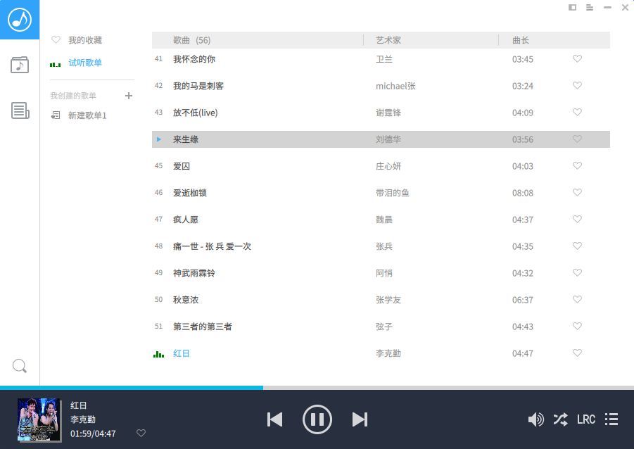
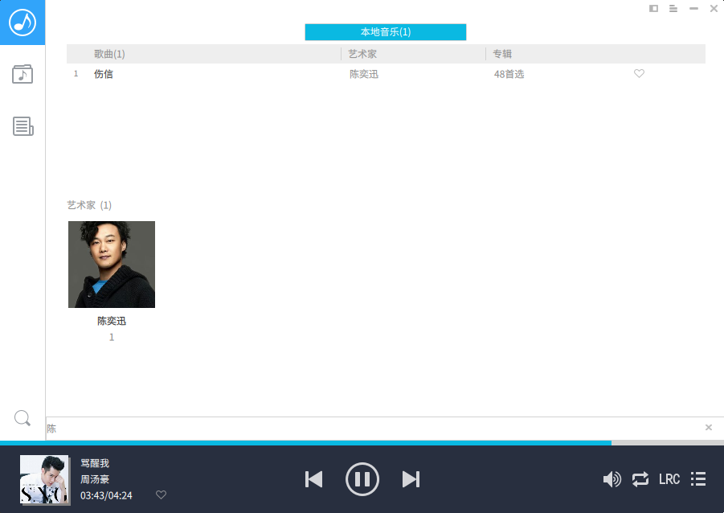

####关于QMusic
QMusic是基于python + PyQT5 + QML的一款本地音乐播放器，旨在提升Linux下更好的音乐播放体验

####特性
+ 具备完整模式，简洁模式，迷你模式三种窗口模式
+ 支持按艺术家、专辑、歌曲、本地文件夹4种分类管理模式
+ 支持播放列表管理
+ 支持全局音乐搜索
+ 支持4种播放模式切换
+ 支持桌面歌词(正在完善中)
+ 更多的特性....

####安装
+ 支持Python2.7
+ 支持PyQt5.3、PyQt5.4 、PyQt5.5各个版本
+ 第三方依赖库：

		chardet==2.3.0
		leveldb==0.193
		mutagen==1.29
		peewee==2.6.4
		requests==2.7.0
		pyquery==1.2.9
		pycurl==7.19.5.1
		faulthandler==2.0

+ ######安装注意
	+ 安装pyquery

			sudo apt-get install libxml2-dev libxslt1-dev python-dev
			sudo apt-get install zlib1g-dev
			pip install pyquery
	
    + 安装 pycurl
 
			sudo apt-get install libcurl4-openssl-dev
			pip install pycurl

####运行

	cd src
	python main.py

####欣赏
+ 本地音乐管理分类

	

+ 播放列表管理

	

+ 全局音乐搜索
	
	

+ 简洁模式
	
	

+ 迷你模式

	

####感谢
+ 感谢[Linux Deepin](http://www.deepin.org/)对开源社区的贡献，里面有很多代码来自与`deepin`的**deepin-music**, 希望大家一如既往的支持`deepin`, 支持开源！
+ 感谢[LiuLang](https://github.com/LiuLang/kwplayer)同学的[kwplayer](https://github.com/LiuLang/kwplayer)

####版权
+ 本软件采用GPL2.1，软件中获取的网络资源均来自网络，因使用本程序引起的一 切侵权问题由使用者本人承担

####协作或Q&A
 + ding465398889@163.com 
 + dragondjf@gmail.com 
 + 465398889@qq.com

